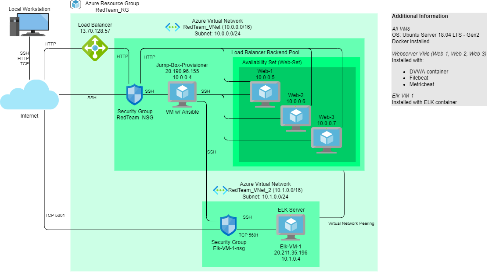
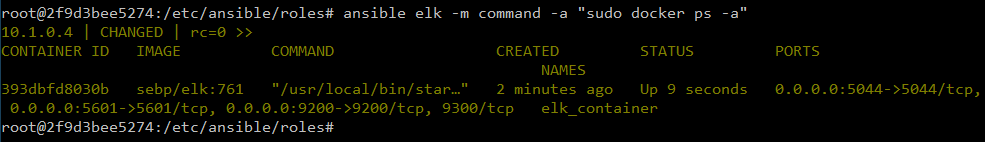

# README

## Automated ELK Stack Deployment

The files in this repository were used to configure the network depicted below.

These files have been tested and used to generate a live ELK deployment on Azure. They can be used to recreate the entire deployment pictured above.

Alternatively, select portions of the [webvm-playbook.yml](ansible/webvm-playbook.yml) file may be used to install only certain pieces of it, such as Filebeat.

This document contains the following details:
- Description of the Topology
- Access Policies
- ELK Configuration
  - Beats in use
  - Machines being monitored
- How to Use the Ansible Build

---

### Description of the Topology

The main purpose of this network is to expose a load-balanced and monitored instance of DVWA (Damn Vulnerable Web Application).

Load balancing ensures that the application will be highly responsive, and improve availability. In addition, the jump box is used to restrict access to the network.

Integrating an ELK server allows users to easily monitor the vulnerable VMs for changes to the log data and system metrics.

The configuration details of each machine may be found below.

| Name | Function | IP Address | Operating System |
|---|---|---|---|
| Jump-Box-Provisioner | Gateway | 10.0.0.4, 20.190.96.155 | Linux |
| Elk-VM-1 | ELK Server | 10.1.0.4, 20.211.35.196 | Linux |
| Web-1 | Webserver | 10.0.0.5 | Linux |
| Web-2 | Webserver | 10.0.0.6 | Linux |
| Web-3 | Webserver | 10.0.0.7 | Linux |

### Access Policies

The machines on the internal network are not exposed to the public Internet. 

Only the _Jump-Box-Provisioner_ and _Elk-VM-1_ machines can accept connections from the Internet. Access to _Jump-Box-Provisioner_ is only allowed from the local workstation (SSH), and access to _Elk-VM-1_ is restriced to _Jump-Box-Provisioner_ (SSH) and the local workstation (TCP port 5601).

Machines within the network can only be accessed by _Jump-Box-Provisioner_ (10.0.0.4).

A summary of the access policies in place can be found in the table below.

| Name | Publicly Accessible | Allowed IP Addresses |
|---|---|---|
| Jump-Box-Provisioner | Yes | Local Workstation |
| Elk-VM-1 | Yes | 10.0.0.4, Local Workstation |
| Web-1 | No | 10.0.0.4 |
| Web-2 | No | 10.0.0.4 |
| Web-3 | No | 10.0.0.4 |

### Elk Configuration

Ansible was used to automate configuration of the ELK machine. No configuration was performed manually, which is advantageous because it allows machines and servers to be reconfigured quickly and easily via code.

The playbook implements the following tasks:
- increase the systems virtual memory (for Elasticsearch)
- install Docker
- install python3
- install the Docker python package
- configuration of the ELK stack container
- ensure the Docker service is started on boot

The following screenshot displays the result of running `docker ps` after successfully configuring the ELK instance.

### Target Machines & Beats

This ELK server is configured to monitor the following machines:
- _TODO: List the IP addresses of the machines you are monitoring_

We have installed the following Beats on these machines:
- _TODO: Specify which Beats you successfully installed_

These Beats allow us to collect the following information from each machine:
- _TODO: In 1-2 sentences, explain what kind of data each beat collects, and provide 1 example of what you expect to see. E.g., `Winlogbeat` collects Windows logs, which we use to track user logon events, etc._

### Using the Playbook

In order to use the playbook, you will need to have an Ansible control node already configured. Assuming you have such a control node provisioned: 

SSH into the control node and follow the steps below:
- Copy the _____ file to _____.
- Update the _____ file to include...
- Run the playbook, and navigate to ____ to check that the installation worked as expected.

_TODO: Answer the following questions to fill in the blanks:_
- _Which file is the playbook? Where do you copy it?_
- _Which file do you update to make Ansible run the playbook on a specific machine? How do I specify which machine to install the ELK server on versus which to install Filebeat on?_
- _Which URL do you navigate to in order to check that the ELK server is running?

_As a **Bonus**, provide the specific commands the user will need to run to download the playbook, update the files, etc._
